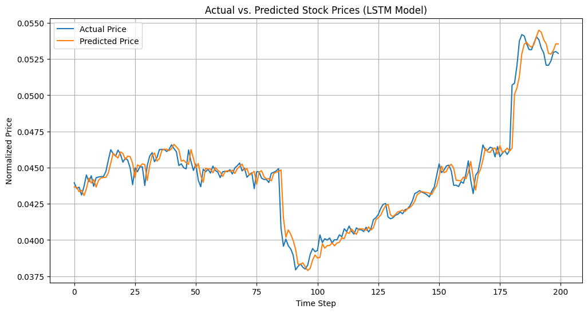

# 📈 AI-Powered Stock Market Prediction Web Application

An end-to-end **Deep Learning-based stock prediction system** that leverages **LSTM, GRU, and CNN-LSTM models** with **Explainable AI (SHAP)** to forecast stock prices and provide transparent insights.

---

## 🚀 Project Overview

Stock market prediction is highly complex due to **non-linearity, volatility, and temporal dependencies**.  
This project introduces a **scalable AI system** that:

- Predicts stock prices using Deep Learning models
- Supports **multi-stock learning with a single model**
- Provides **interactive visualizations via web application**
- Integrates **Explainable AI (SHAP)** for transparency

---

## 🧠 Models Used

| Model | Description |
|------|------------|
| 🔵 LSTM | Captures long-term dependencies in time series |
| 🟢 GRU | Lightweight alternative with faster convergence |
| 🟣 CNN-LSTM | Hybrid model for spatial + temporal feature extraction |

---

## ⚙️ System Workflow

1. Data Collection (Yahoo Finance via yfinance)
2. Data Preprocessing & Normalization
3. Time-Series Sequence Creation
4. Model Training (LSTM, GRU, CNN-LSTM)
5. Evaluation (MSE, RMSE, MAE, R²)
6. Prediction & Visualization
7. Explainability using SHAP

---

## 📊 Results & Outputs

### 📉 Actual vs Predicted Prices

### 📊 Multi-Stock Learning
- Model trained across multiple stocks
- Improves generalization capability

### 🔄 Direction Prediction
- Predicts upward/downward movement
- Achieves ~50–55% directional accuracy

---

## 📊 Model Performance

### 🔹 Single Stock Prediction
| Model | Performance |
|------|------------|
| GRU | ✅ Best performance |
| LSTM | Good performance |
| CNN-LSTM | Higher error |

### 🔹 Multi-Stock Prediction
| Model | Performance |
|------|------------|
| LSTM | ✅ Best performance |
| GRU | Slightly lower |
| CNN-LSTM | Less efficient |

---

## 📉 Error Analysis

- Errors centered around zero → unbiased predictions
- Occasional spikes during high volatility
- Stable performance across time

---

## 📈 Training Behavior

- Smooth convergence of loss curves
- Minimal overfitting observed

---

## 🔍 Explainable AI (SHAP)

- Explains contribution of historical inputs
- Improves transparency of predictions
- Highlights feature importance in time-series data

---

## 📌 Key Insights

- GRU performs best for **single-stock prediction**
- LSTM performs best for **multi-stock prediction**
- Multi-stock learning improves scalability
- SHAP enhances interpretability
- Direction prediction remains challenging

---

## 🛠️ Tech Stack

- Python (NumPy, Pandas, Matplotlib)
- TensorFlow / Keras
- yfinance API
- SHAP (Explainable AI)
- Flask (Web App)

---

## 📂 Repository Structure
