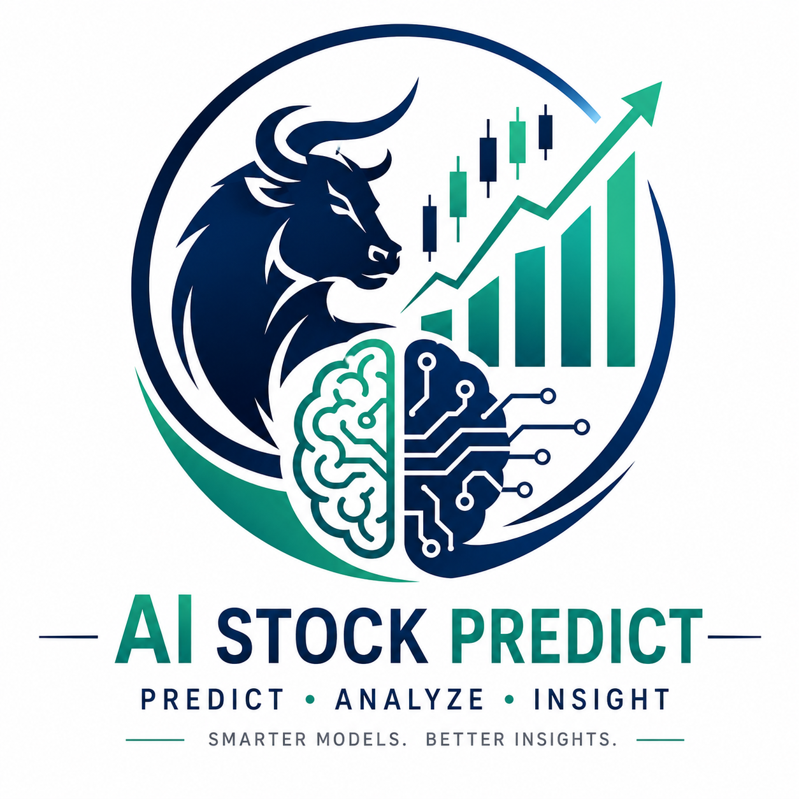
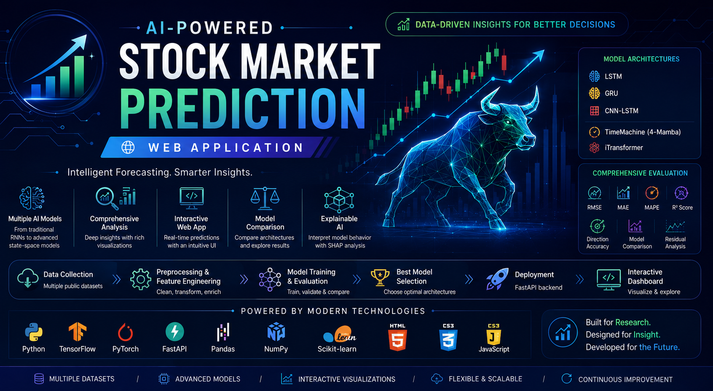
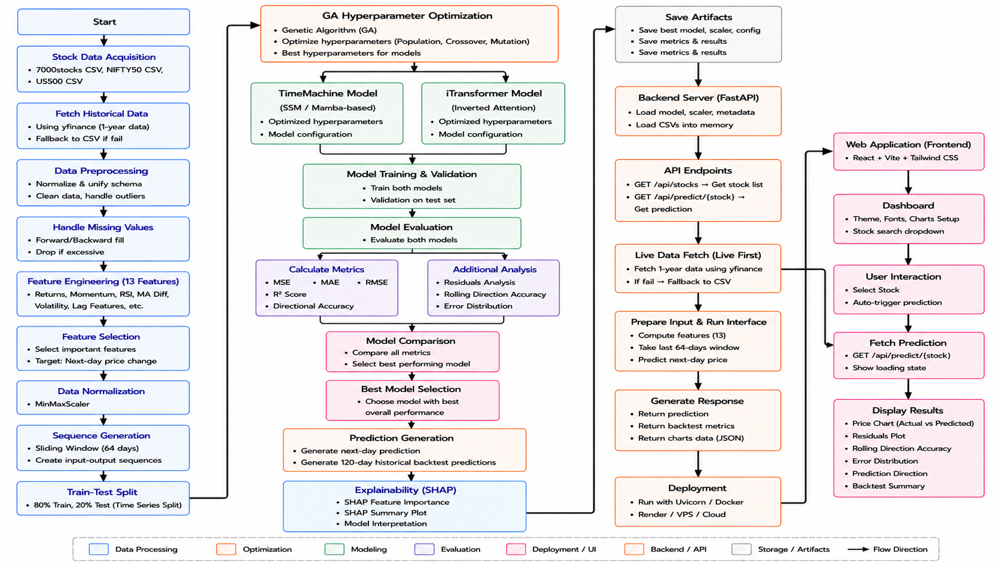
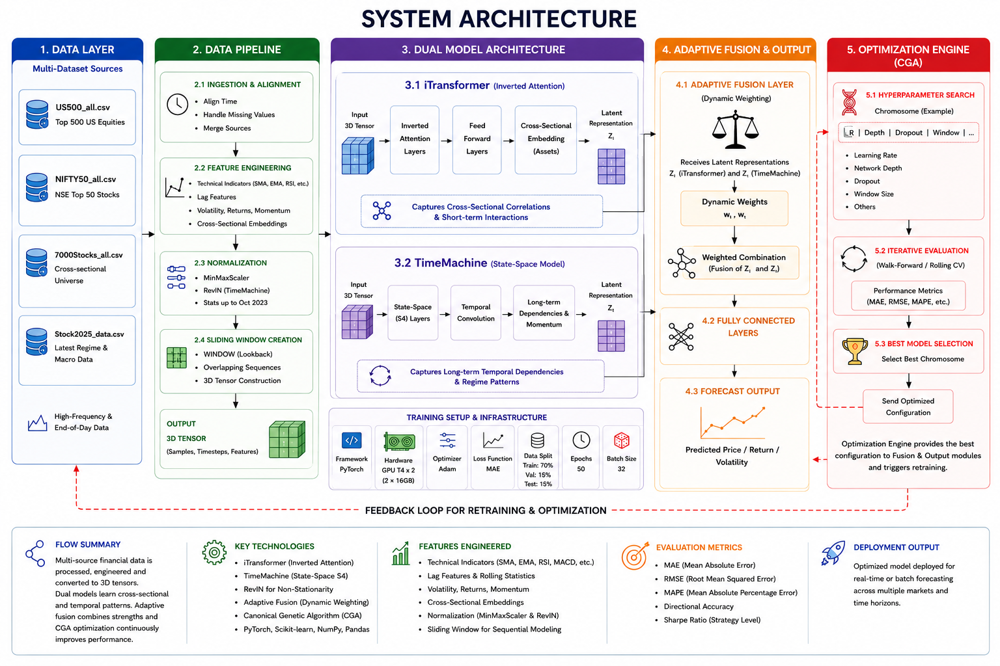

<div>
  <h1 align="center">
     AI-Powered Stock Market Prediction Web Application
  </h1>
</div>
<p align="center">
  
</p>

> **An End-to-End Intelligent Stock Market Forecasting System using Deep Learning, State-Space Models, and Modern Web Technologies**

<p align="center">


</p>

---

<p align="center">

### 📈 Forecast Smarter • 🤖 Compare AI Models • 🌐 Interactive Web Application

</p>

---

# 📌 Overview

Stock market forecasting remains one of the most challenging tasks in financial analytics due to the nonlinear, dynamic, and highly volatile nature of stock prices.

This repository presents an **end-to-end AI-powered Stock Market Prediction System** that explores the evolution of deep learning models—from traditional recurrent neural networks to modern State-Space architectures—and deploys the best-performing model through an interactive web application.

The project demonstrates the complete machine learning lifecycle:

- 📊 Data Collection
- 🧹 Data Preprocessing
- ⚙️ Feature Engineering
- 🧠 Deep Learning Model Development
- 📈 Performance Evaluation
- 📉 Explainability Analysis
- 🚀 Model Deployment
- 🌐 Interactive Web Dashboard

---

# 🎯 Project Objectives

The primary objectives of this project are:

- Predict future stock prices using Deep Learning.
- Compare multiple neural network architectures.
- Study the evolution from traditional sequence models to advanced forecasting architectures.
- Evaluate prediction accuracy using multiple regression metrics.
- Analyze directional movement prediction.
- Deploy the best-performing model as an interactive web application.
- Build a scalable forecasting framework supporting multiple stock datasets.

---

# 🚀 Project Evolution

The project is divided into two major phases.

## 📘 Phase 1 — Traditional Deep Learning

This phase focuses on widely adopted recurrent neural network architectures.

### Models

- Long Short-Term Memory (LSTM)
- Gated Recurrent Unit (GRU)
- CNN-LSTM Hybrid

This module demonstrates:

- Historical stock prediction
- Model comparison
- Training visualization
- SHAP explainability
- Performance evaluation

---

## 📗 Phase 2 — Advanced Deep Learning

The second phase introduces modern sequence forecasting architectures.

### Models

- TimeMachine (State-Space 4-Mamba)
- iTransformer (Inverted Transformer)

Additional features include:

- Automatic best model selection
- Dynamic model loading
- FastAPI deployment
- Interactive dashboard
- Live Yahoo Finance integration
- Offline dataset fallback

---

# 🌟 Key Features

## 🤖 Artificial Intelligence

- Multiple Deep Learning Architectures
- Comparative Model Analysis
- Time-Series Forecasting
- Feature Engineering
- Explainable AI
- Regression Analysis
- Direction Prediction

---

## 📊 Data Analysis

- Multi-stock prediction
- Historical stock analysis
- Technical indicator generation
- Rolling window forecasting
- Model evaluation metrics

---

## 🌐 Web Application

- FastAPI Backend
- REST API
- Interactive Dashboard
- Responsive UI
- Searchable Stock Selection
- Live Stock Data
- Automatic Model Selection
- Dynamic Prediction Visualization

---

# ⚡ Highlights

✅ Traditional Deep Learning Models

✅ Advanced State-Space Models

✅ Interactive Web Application

✅ Multi-Dataset Support

✅ Dynamic Model Loading

✅ Live Market Data Integration

✅ Explainability using SHAP

✅ Interactive Performance Charts

✅ Professional Project Structure

---

# 📂 Quick Navigation

| Folder | Description |
|---------|-------------|
| 📘 **traditional_models/** | LSTM, GRU, CNN-LSTM implementation |
| 📗 **advanced_models/** | TimeMachine, iTransformer & Web Application |
| 📄 **docs/** | Project report and documentation |
| 📊 **screenshots/** | Web application screenshots |
| 📁 **requirements.txt** | Project dependencies |
| 📄 **LICENSE** | MIT License |

---

> **This repository demonstrates the complete evolution of AI-based stock market forecasting—from traditional recurrent neural networks to advanced State-Space deep learning architectures with real-world deployment.**

---

# 🗂 Repository Structure

```text
AI-Powered-Stock-Prediction-Web-Application
│
├── 📂 traditional_models/
│   ├── 📓 Evolution_stock_prediction.ipynb
│   ├── 📄 tickers.csv
│   ├── 📂 sample_dataset/
│   ├── 📂 saved_models/
│   ├── 📂 results/
│   └── 📄 README.md
│
├── 📂 advanced_models/
│   ├── 📓 stock-market-forecasting.ipynb
│   ├── 🐍 backend.py
│   ├── 🌐 index.html
│   ├── 🎨 style.css
│   ├── ⚡ app.js
│   ├── 📂 data/
│   ├── 📂 saved_models/
│   ├── 📂 results/
│   └── 📄 README.md
│
├── 📂 docs/
│   ├── 📑 Project Report
│   └── 🖼 Architecture Diagram
│   
│
├── 📂 screenshots/
│   ├── Home.png
│   ├── Prediction.png
│   ├── Charts.png
│   └── Mobile.png
│   
│
├── 📄 requirements.txt
├── 📄 .gitignore
├── 📄 LICENSE
└── 📄 README.md
```

---

# 🔄 Complete Project Workflow

```text
                Historical Stock Data
                         │
                         ▼
               Data Collection (Yahoo Finance)
                         │
                         ▼
                 Data Cleaning & Processing
                         │
                         ▼
                 Feature Engineering
                         │
          ┌──────────────┴──────────────┐
          │                             │
          ▼                             ▼
Traditional Deep Learning       Advanced Deep Learning
     (Phase-I)                     (Phase-II)
          │                             │
 ┌────────┼────────┐          ┌──────────┴──────────┐
 ▼        ▼        ▼          ▼                     ▼
LSTM     GRU    CNN-LSTM   TimeMachine         iTransformer
                               │                     │
                               └──────────┬──────────┘
                                          ▼
                               Performance Evaluation
                                          │
                                          ▼
                              Best Model Selection
                                          │
                                          ▼
                             FastAPI Web Deployment
                                          │
                                          ▼
                          Interactive Prediction Dashboard
```
## 🔁 WorkFlow (Phase-II)

<p align="center">

</p>

---

# 🏗 System Architecture

<p align="center">

</p>

```

---

# 📊 Dataset

This project uses a curated stock market dataset created by integrating multiple publicly available historical stock market datasets from Kaggle. The datasets were organized into a unified collection to support data preprocessing, model training, evaluation, and deployment.

The curated dataset is publicly available on Kaggle and can be downloaded from the following link:

**📥 Download the complete dataset:**  
[`Kaggle - Stock Market Datasets`](https://www.kaggle.com/datasets/bijoybhadra/stock-market-datasets)

---

## Included Datasets

| Dataset | Description |
|----------|-------------|
| 🇺🇸 US500 | Historical stock market data for major U.S. listed companies |
| 🇮🇳 NIFTY50 | Historical stock market data for NIFTY 50 companies |
| 🌍 7000Stocks | Large-scale historical stock market dataset containing thousands of companies |

> **Note:** The dataset is a curated compilation of multiple publicly available Kaggle datasets. Credit belongs to the original dataset creators for the source data, while this repository provides the integrated dataset used in this project.

---

## Dataset Attributes

Each dataset contains the following features:

| Feature | Description |
|----------|-------------|
| Date | Trading date |
| Open | Opening price |
| High | Highest trading price |
| Low | Lowest trading price |
| Close | Closing price |
| Volume | Trading volume |

---

## Dataset Availability

Due to GitHub's file size limitations, the complete datasets are **not included** in this repository.

Instead, the repository provides:

- Sample datasets
- Stock ticker list
- Data preprocessing pipeline
- Instructions for downloading the complete dataset

The complete curated dataset can be downloaded from the Kaggle link provided above.

---

# ⚙️ Technology Stack

## Programming Languages

| Technology | Purpose |
|------------|---------|
| Python | AI Model Development |
| JavaScript | Interactive Dashboard |
| HTML5 | Web Interface |
| CSS3 | User Interface Design |

---

## Machine Learning & Deep Learning

| Library | Purpose |
|----------|---------|
| TensorFlow | Traditional Deep Learning Models |
| Keras | LSTM, GRU & CNN-LSTM |
| PyTorch | Advanced Deep Learning Models |
| Scikit-learn | Data Preprocessing & Evaluation |

---

## Backend Technologies

| Technology | Purpose |
|------------|---------|
| FastAPI | REST API |
| Uvicorn | ASGI Server |

---

## Data Processing

| Library | Purpose |
|----------|---------|
| NumPy | Numerical Computing |
| Pandas | Data Manipulation |
| yfinance | Live Stock Data |

---

## Visualization

| Library | Purpose |
|----------|---------|
| Matplotlib | Data Visualization |
| SHAP | Explainable AI |
| Chart.js | Interactive Dashboard Charts |

---

# 📈 Model Evaluation Metrics

The models are evaluated using multiple regression and directional forecasting metrics.

| Metric | Description |
|---------|-------------|
| MSE | Mean Squared Error |
| RMSE | Root Mean Squared Error |
| MAE | Mean Absolute Error |
| R² Score | Coefficient of Determination |
| Direction Accuracy | Trend Prediction Accuracy |
| Rolling Direction Accuracy | Short-term Trend Evaluation |
| Residual Error | Prediction Error Analysis |
| Prediction Error Density | Error Distribution Analysis |

---

# 📊 Generated Results

The project generates multiple visualization outputs to evaluate model performance.

### Traditional Models

- 📈 Actual vs Predicted Price
- 📉 Closing Price Trend
- 📊 Direction Movement
- 📉 Residual Error
- 📈 Training & Validation Curve
- 📊 SHAP Summary
- 📈 Model Comparison

---

### Advanced Models

- 📈 Actual vs Predicted Price
- 📉 Residual Error
- 📊 Rolling Direction Accuracy
- 📈 Prediction Error Density
- 📉 Actual vs Predicted Direction
- 📊 Interactive Dashboard
- 📈 Live Stock Forecasting

---

# 📘 Traditional Deep Learning Models

The **Traditional Models** module explores three widely used deep learning architectures for stock market forecasting.

These models establish a strong baseline for sequential financial time-series prediction and provide insights into how different recurrent neural networks learn market trends.

## Implemented Models

| Model | Description |
|--------|-------------|
| 🧠 LSTM | Long Short-Term Memory Network for long-term dependency learning |
| ⚡ GRU | Gated Recurrent Unit with fewer parameters and faster convergence |
| 🔀 CNN-LSTM | Hybrid architecture combining CNN feature extraction with LSTM sequence learning |

---

## Traditional Model Pipeline

```text
Historical Stock Data
        │
        ▼
Data Preprocessing
        │
        ▼
Feature Scaling
        │
        ▼
Sequence Generation
        │
        ▼
LSTM / GRU / CNN-LSTM
        │
        ▼
Performance Evaluation
        │
        ▼
Model Comparison
        │
        ▼
Explainability (SHAP)
```

---

## Traditional Model Features

- Historical stock price prediction
- Multi-stock forecasting
- Sliding window sequence generation
- Model comparison
- Training visualization
- SHAP Explainability
- Error analysis
- Direction movement analysis

📖 **More details:** [`traditional_models/README.md`](traditional_models/README.md)

---

# 🚀 Advanced Deep Learning Models

The **Advanced Models** module introduces modern sequence modeling architectures specifically designed for long-range time-series forecasting.

These models improve forecasting capability while supporting deployment through an interactive web application.

---

## Implemented Models

| Model | Description |
|--------|-------------|
| 🚀 TimeMachine | State-Space (4-Mamba) architecture for efficient long-sequence forecasting |
| 🔷 iTransformer | Inverted Transformer architecture for multivariate time-series prediction |

---

## Advanced Model Pipeline

```text
Historical Stock Data
        │
        ▼
Feature Engineering
        │
        ▼
RevIN Normalization
        │
        ▼
TimeMachine / iTransformer
        │
        ▼
Performance Evaluation
        │
        ▼
Best Model Selection
        │
        ▼
FastAPI Deployment
        │
        ▼
Interactive Dashboard
```

---

## Advanced Model Features

- Time-Series Forecasting
- Automatic Model Selection
- Dynamic Model Loading
- Live Yahoo Finance Integration
- Offline Dataset Support
- Interactive Prediction Dashboard
- REST API Deployment
- Interactive Charts

📖 **More details:** [`advanced_models/README.md`](advanced_models/README.md)

---

# 🌐 Interactive Web Application

The project includes a modern web application for real-time stock prediction and visualization.

## Backend

- FastAPI
- REST API
- Dynamic Model Loading
- Live Data Retrieval
- Prediction API

---

## Frontend

- HTML5
- CSS3
- JavaScript
- Chart.js

---

## Dashboard Features

- 🔍 Searchable Stock Selector
- 📈 Stock Price Prediction
- 📉 Actual vs Predicted Price
- 📊 Prediction Summary Cards
- 📈 Rolling Direction Accuracy
- 📉 Residual Error Analysis
- 📊 Prediction Error Density
- 📈 Direction Comparison Chart
- ⚡ Responsive User Interface

---

# 📊 Model Comparison

| Feature | Traditional Models | Advanced Models |
|----------|:-----------------:|:---------------:|
| LSTM | ✅ | ❌ |
| GRU | ✅ | ❌ |
| CNN-LSTM | ✅ | ❌ |
| TimeMachine | ❌ | ✅ |
| iTransformer | ❌ | ✅ |
| Multi-stock Prediction | ✅ | ✅ |
| SHAP Explainability | ✅ | ✅ |
| Live Stock Data | ❌ | ✅ |
| FastAPI Deployment | ❌ | ✅ |
| Interactive Dashboard | ❌ | ✅ |
| Dynamic Model Selection | ❌ | ✅ |
| REST API | ❌ | ✅ |

---

# 📊 Results

Both implementations generate comprehensive evaluation results.

## Traditional Models

- Actual vs Predicted Price
- Closing Price Trend
- Model Comparison
- Training & Validation Loss
- Residual Error
- Direction Movement
- SHAP Summary
- Prediction Error Analysis

---

## Advanced Models

- Actual vs Predicted Price
- Residual Error
- Rolling Direction Accuracy
- Prediction Error Density
- Actual vs Predicted Direction
- Interactive Dashboard
- Live Forecast Visualization

---

# 📄 Documentation

The repository includes complete project documentation.

## Available Documents

- 📘 Traditional Models Documentation
- 📗 Advanced Models Documentation
- 📄 Project Report
- 🏗 System Architecture
- 📊 Experimental Results
- 📈 Performance Evaluation
- 🖼 Application Screenshots

Each module contains its own dedicated `README.md` with detailed implementation information, usage instructions, and evaluation results.

---

# 🎯 Why This Repository?

This repository demonstrates the progression from **traditional recurrent neural networks** to **modern State-Space and Transformer architectures**, culminating in a deployable AI-powered stock forecasting web application.

It combines:

- 📚 Deep Learning Research
- 📊 Financial Time-Series Analysis
- 🤖 Artificial Intelligence
- 🌐 Web Development
- 🚀 Model Deployment
- 📈 Interactive Data Visualization

making it a complete end-to-end machine learning project suitable for academic, research, and portfolio purposes.

---

# 🚀 Getting Started

Follow the steps below to set up and run the project on your local machine.

---

# 📋 Prerequisites

Before running the project, ensure you have the following installed:

| Software | Version |
|----------|----------|
| Python | 3.10 or later |
| Git | Latest |
| Jupyter Notebook | Latest |
| Visual Studio Code *(Recommended)* | Latest |

---

# 📥 Clone the Repository

```bash
git clone https://github.com/Bijoy781999/AI-Powered-Stock-Prediction-Web-Application.git
```

Move into the project directory.

```bash
cd AI-Powered-Stock-Prediction-Web-Application
```

---

# 📦 Install Dependencies

Install all required Python libraries.

```bash
pip install -r requirements.txt
```

---

# 📂 Project Modules

The repository consists of two independent implementations.

## 📘 Traditional Models

Location

[`traditional_models/`](traditional_models/)

Contains

- LSTM
- GRU
- CNN-LSTM

---

## 📗 Advanced Models

Location

[`advanced_models/`](advanced_models/)

Contains

- TimeMachine
- iTransformer
- FastAPI Backend
- Interactive Dashboard

---

# ▶ Running Traditional Models

Navigate to

[`traditional_models/`](traditional_models/)

Launch Jupyter Notebook

```bash
jupyter notebook
```

Open

```text
Evolution_stock_prediction.ipynb
```

Run all notebook cells sequentially.

The notebook will

- Load datasets
- Preprocess data
- Train models
- Compare performance
- Generate evaluation plots
- Save trained models

---

# ▶ Running Advanced Models

Navigate to

[`advanced_models/`](advanced_models/)

Open

```text
stock-market-forecasting.ipynb
```

Run all notebook cells.

The notebook will

- Load datasets
- Perform feature engineering
- Train TimeMachine
- Train iTransformer
- Compare performance
- Save the best model

---

# 🌐 Running the Web Application

Navigate to

[`advanced_models/`](advanced_models/)

Start the FastAPI server

```bash
uvicorn backend:app --reload
```

or

```bash
python backend.py
```

Once the server starts successfully, open your browser and visit

```text
http://127.0.0.1:8000
```

---

# 💻 Using the Dashboard

The web application allows users to

- 🔍 Search available stocks
- 📈 Generate stock price predictions
- 📉 Compare actual vs predicted prices
- 📊 Analyze prediction errors
- 📈 View rolling direction accuracy
- 📉 Analyze residual errors
- 📊 Explore interactive charts

---

# 📊 Generated Outputs

## Traditional Models

Running the notebook produces

- Actual vs Predicted Price
- Closing Price Trend
- Direction Movement
- Training & Validation Curve
- Residual Error
- Prediction Error Density
- SHAP Summary
- Model Comparison

---

## Advanced Models

Running the notebook generates

- Actual vs Predicted Price
- Residual Error
- Rolling Direction Accuracy
- Prediction Error Density
- Actual vs Predicted Direction
- Interactive Dashboard
- Best Model Information

---

# 📁 Saved Models

Trained models are stored inside

```text
traditional_models/saved_models/
```

and

```text
advanced_models/saved_models/
```

These folders contain the trained weights generated after model training.

> **Note:** Large model files may not be included in the repository because of GitHub's file size limitations.

---

# 📊 Results

All generated plots and evaluation figures are available inside

[`traditional_models/results/`](traditional_models/results/)

and

[`advanced_models/results/`](advanced_models/results/)

These include

- Prediction graphs
- Training curves
- Error analysis
- Model comparison
- SHAP visualizations
- Dashboard screenshots

---

# 📂 Dataset Setup

This project uses historical stock market data.

Datasets supported include

- US500
- NIFTY50
- 7000Stocks

The repository includes sample datasets for demonstration purposes.

If you wish to reproduce the experiments with the complete datasets, download historical market data using **Yahoo Finance (yfinance)** and place the files inside the corresponding `data/` directory.

---

# 📌 Project Execution Flow

```text
Clone Repository
        │
        ▼
Install Dependencies
        │
        ▼
Choose Project Module
        │
        ├──────────────┐
        ▼              ▼
Traditional      Advanced
   Models          Models
        │              │
        ▼              ▼
 Train Models   Train Models
        │              │
        └──────┬───────┘
               ▼
       Performance Analysis
               ▼
       Save Trained Models
               ▼
      Launch Web Application
               ▼
        Predict Stock Prices
```

---

# 📖 Additional Documentation

Each module contains its own dedicated documentation.

| Module | Documentation |
|----------|--------------|
| 📘 Traditional Models | [`traditional_models/README.md`](traditional_models/README.md) |
| 📗 Advanced Models | [`advanced_models/README.md`](advanced_models/README.md) |
| 📄 Project Report | [`docs/`](docs/) |
| 📊 Experimental Results | [`results/`](results/) |
| 📸 Screenshots | [`screenshots/`](screenshots/) |

For implementation details, datasets, model architecture, and experimental results, refer to the corresponding module documentation.

---

# 🤝 Contributing

Contributions are always welcome!

If you have ideas for improving this project, fixing bugs, or adding new features, feel free to contribute.

## How to Contribute

1. Fork this repository.
2. Create a new feature branch.

```bash
git checkout -b feature/your-feature-name
```

3. Commit your changes.

```bash
git commit -m "Add your feature"
```

4. Push to your branch.

```bash
git push origin feature/your-feature-name
```

5. Open a Pull Request.

---

# 🔮 Future Improvements

This project can be extended with several advanced features, including:

## 🤖 Artificial Intelligence

- Transformer-based forecasting models
- Temporal Fusion Transformer (TFT)
- PatchTST
- Informer
- Autoformer
- FEDformer
- TimesNet

---

## 📈 Financial Analysis

- Multi-step stock forecasting
- Portfolio optimization
- Risk analysis
- Volatility prediction
- Market trend classification
- Sector-wise forecasting

---

## 📰 Sentiment Analysis

- Financial News Analysis
- Twitter/X Sentiment
- Reddit Market Sentiment
- Economic Indicator Integration

---

## 🌐 Web Application

- User Authentication
- Personalized Dashboard
- Watchlist Management
- Portfolio Tracking
- Cloud Deployment
- Docker Support
- Real-time WebSocket Updates
- Mobile Responsive Improvements

---

## ☁ Deployment

- Docker Containerization
- AWS Deployment
- Microsoft Azure
- Google Cloud Platform
- CI/CD Pipeline
- Kubernetes

---

# 📚 References

The implementation is inspired by concepts from the following areas:

- Deep Learning for Time-Series Forecasting
- Recurrent Neural Networks (RNN)
- Long Short-Term Memory (LSTM)
- Gated Recurrent Unit (GRU)
- CNN-LSTM Hybrid Networks
- State-Space Models (Mamba)
- Transformer-based Time-Series Forecasting
- Explainable Artificial Intelligence (SHAP)
- Financial Time-Series Analysis

---

# 🙏 Acknowledgements

Special thanks to:

- JIS College of Engineering
- Department of Computer Science & Technology
- Faculty members and mentors for their guidance
- Open-source community
- Yahoo Finance for historical market data
- TensorFlow Community
- PyTorch Community
- FastAPI Community

Their resources and contributions made this project possible.

---

# 👨‍💻 Author

## Bijoy Bhadra

**B.Tech in Computer Science & Technology**

JIS College of Engineering

### Areas of Interest

- Artificial Intelligence
- Machine Learning
- Deep Learning
- Financial Time-Series Forecasting
- Explainable AI
- Computer Vision
- Natural Language Processing

---

# 📬 Contact

If you have any questions, suggestions, or collaboration opportunities, feel free to reach out.

**GitHub**

```
https://github.com/Bijoy781999
```

---

# 📄 License

This project is licensed under the **MIT License**.

You are free to:

- Use
- Modify
- Share
- Distribute

while preserving the original license.

See the **LICENSE** file for complete details.

---

# 📖 Citation

If you use this repository for academic research or educational purposes, please cite it appropriately.

Example:

```text
Bijoy Bhadra.
AI-Powered Stock Market Prediction Web Application.
GitHub Repository.
2026.
```

---

# 📊 Repository Summary

| Category | Details |
|----------|----------|
| Domain | Stock Market Prediction |
| Type | End-to-End AI Project |
| Models | LSTM, GRU, CNN-LSTM, TimeMachine, iTransformer |
| Backend | FastAPI |
| Frontend | HTML, CSS, JavaScript |
| Frameworks | TensorFlow, Keras, PyTorch |
| Data Source | Yahoo Finance |
| Evaluation | Regression & Direction Prediction |
| Explainability | SHAP |
| Deployment | FastAPI Web Application |

---

# 🌟 If You Like This Project

If you found this repository useful, please consider:

⭐ Starring the repository

🍴 Forking the project

🛠 Contributing to future improvements

📢 Sharing it with others

Your support motivates future development and improvements.

---

<div align="center">

# ⭐ Thank You for Visiting ⭐

### AI-Powered Stock Market Prediction Web Application

**Developed with ❤️ using Artificial Intelligence, Deep Learning, and Modern Web Technologies**

**Happy Coding! 🚀**

</div>

---
